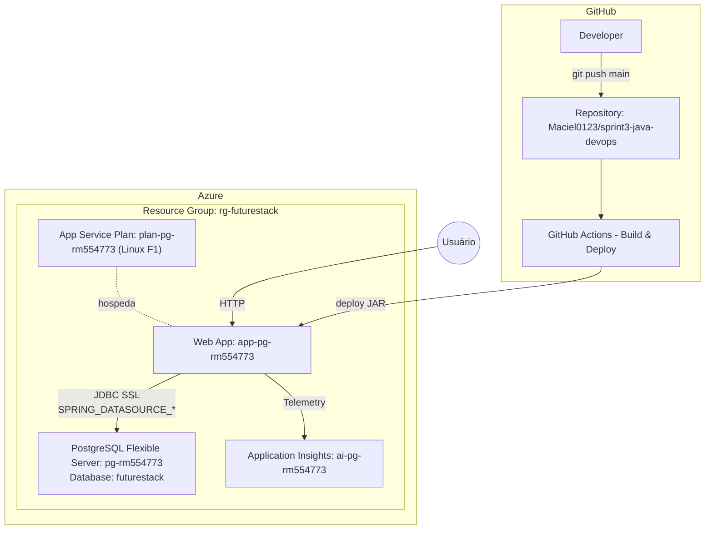

# futureStack 

Sistema inteligente de rastreamento de motos via Wi-Fi, com mapeamento digital em tempo real e adaptável a diferentes filiais.

## 📋 Descrição da Solução

O **futureStack** é uma solução de monitoramento de motos que utiliza gateways Wi-Fi posicionados estrategicamente para detectar automaticamente a presença de veículos em duas zonas principais: **Zona A (Pátio)** e **Zona B (Manutenção)**.

Cada moto emite sinal que é captado pelo **gateway instalado em cada zona**. Com base na intensidade do sinal (`RSSI`), o sistema identifica a localização aproximada da moto e atualiza sua posição em um **mapa digital**. Além disso, são apresentados dados como **metragem total de cada zona**, **ocupação atual** e uma **visualização detalhada em tempo real**.

O sistema também permite **buscas por placa ou modelo**, e é totalmente **adaptável a diferentes filiais**, com cadastro personalizado da metragem de pátio e manutenção, além de gateways exclusivos por local.

## Essa API permite:

- Cadastro de patios com metragem
- Busca por **placa** ou **modelo**
- Paginação, ordenação e filtros
- Validação de campos com Bean Validation

## Principais Endpoints (CRUD):

- 🏍️ Motos

Listar todas as motos
GET /motos

```
GET http://localhost:8080/motos
```

Listar motos com filtro por modelo
GET /motos?modelo={modelo}&page={n}&size={n}&sort={campo}

```
GET http://localhost:8080/motos?modelo=honda&page=0&size=10&sort=modelo
```
Listar motos com filtro por placa
GET /motos?placa={placa}&page={n}&size={n}

```
GET http://localhost:8080/motos?placa=ABC&page=0&size=10
```

Criar nova moto
POST /motos

Body (JSON):
```
{
    "modelo": "Honda 160",
    "placa": "AADR34",
    "zonaId": 1,
    "status": "DISPONIVEL"
}
```

Atualizar moto
PUT /motos/{id}

Body (JSON):
```
{
    "modelo": "Honda 169",
    "placa": "AADR74",
    "zonaId": 2,
    "status": "DISPONIVEL"
}
```
Excluir moto
DELETE /motos/{id}

- 🅿️Patio
```
```
Listar todos os pátios
GET /patios

```
GET http://localhost:8080/patios
```

Buscar pátio por ID
GET /patios/{id}

Criar novo pátio
POST /patios

Body (JSON):
```
{
  "nome": "Pátio Central",
  "quantidadeVagas": 50,
  "metragemZonaA": 100.5,
  "metragemZonaB": 80.0
}
```

Atualizar pátio
PUT /patios/{id}

Body (JSON):

```
{
  "nome": "Pátio Central Atualizado",
  "quantidadeVagas": 60,
  "metragemZonaA": 120.0,
  "metragemZonaB": 90.0
}
```

Excluir pátio
DELETE /patios/{id}

## 🚀 Tecnologias Utilizadas

- Java 17
- Spring Boot 
- Spring Web
- Spring Data JPA
- Spring Cache
- Spring Validation (Bean Validation)
- Banco H2
- Lombok
- Swagger

## 🛠️ Como Rodar o Projeto Localmente

1. **Clone o repositório:**

```bash
git clone https://github.com/seu-usuario/sprint1-java.git
cd sprint1-java
```

3. **rode a aplicação**

## 🧠 Funcionalidades Futuras

- Integração com API dos gateways IoT
- Integração com o front-end
##Arquitetura do Projeto


## Executando com Azure App Service

- Faça um Fork do projeto original
- Baixe o scrip DevOps-Challenge.sh localizado na raiz do projeto
- Abra o Azure CLI (em sua conta) e execute os comandos a baixo:
```
az provider register --namespace Microsoft.Web
 
az provider register --namespace Microsoft.Insights
az provider register --namespace Microsoft.OperationalInsights
 
az provider register --namespace Microsoft.ServiceLinker
 
az provider register --namespace Microsoft.Sql
 
az provider register --namespace Microsoft.DBforPostgreSQL
 
az extension add --name application-insights
```
- Depois clique em "Gerenciar Arquivos" e faça o upload do script
- Execute os comandos abaixo, o primeiro irá dar permissão para executar o arquivo e o segudo irá executa-lo
```
chomod +x ./DevOps-Challenge.sh
```
```
./DevOps-Challenge.sh
```
- Após o comando os recursos serão criados e será solicitado que você faça a autenticação no github
- Acesse a configurações, vá em security>secrets and variables>actions e cadastre suas variaveis de ambiente
- Após o build ser concluido você reberá uma URL para usar a aplicação
- Atualize o diretorio "workflows" e coloque as variaveis no seu arquivo yml
- Logo após o commit o deploy deve rodar sozinho, caso não aconteça, vá em "actions" e faça um 're-run' do build
  
## 👥 Integrantes

- Mariana Christina RM: 554773
- Gabriela Moguinho RM: 556143
- Henrique Maciel RM: 556480
